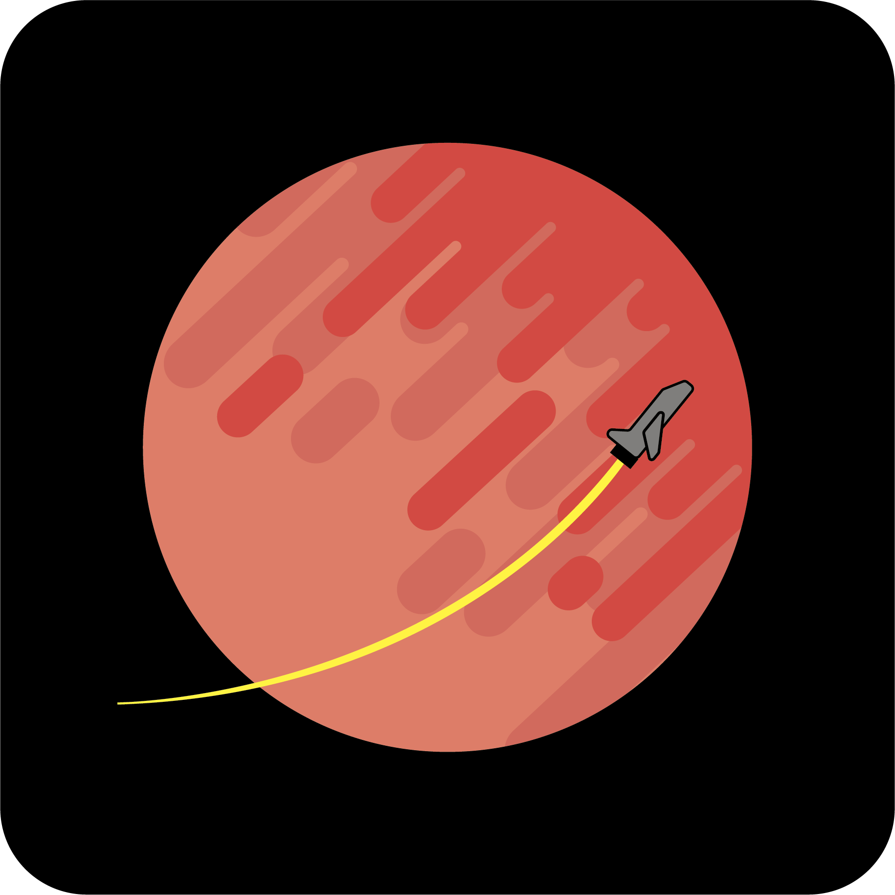

  </img>

<h1 align="center">Infinity Fury</h1>
<h3 align="center">Космический казуальный скроллер</h1>

 

# Статус

*В данный момент проект заморожен из-за недостатка команды и навыков, чтобы выпустить игру в AppStore и PlayMarket.* 

# Описание
🚀Infinity Fury - мобильная игра в жанре casual scroller. Вам предлагается как медитативно отстреливать вражеские космические объекты, так и устроить настоящую схватку с сильными боссами, обладающими уникальными механиками атаки. 

💥В арсенале Вашего корабля есть всё. От простых лазерных пуль, до управляемых дронов и ультимативных бомб! Но не всё так просто. Упрощаешь - усложняй, враги обладают ничуть не меньшим набором вооружения.

🏆Основная задача игры - создать челлендж для Вас. После прохождения основной игровой кампании, у Вас сбросится игровой прогресс и повысится престиж. 

💯Игровой визуал максимально кастомизируется. Различные скины будут на всё. Космические корабли, астероиды, фоны, ракеты, дроны и многое другое.

#  Геймплей
Вы можете посмотреть видео с гемплеем на [YouTube](https://youtu.be/m4ZbioQ5KLo) в более высоком качестве.

https://github.com/sund3RRR/MobileInfinityFury/assets/73298492/88e6f00b-ad62-41f0-a603-424c18eddde6

